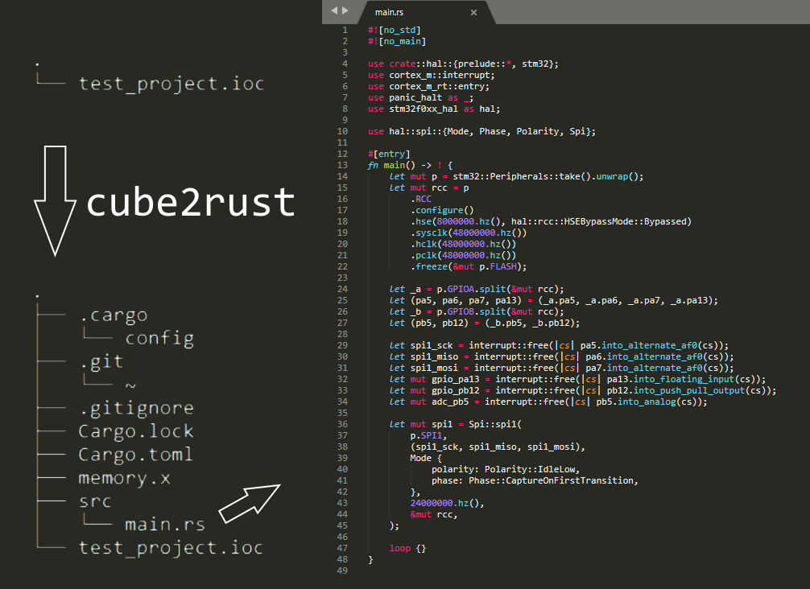

# cube2rust
A tool for generating a rust project from a STM32CubeMX ioc file.



The tool will run `cargo init` in the same directory as the ioc file.

It will then add dependencies to `Cargo.toml` and generate a `src/main.rs`, `.cargo/config` and `memory.x`.

Currently, running this tool will overwrite everything, so use with caution. 

## Installation
```bash
$ cargo install cube2rust
```
## Usage
From inside a directory containing an ioc file
```bash
$ cube2rust
```

From anywhere
```bash
$ cube2rust path/to/project_directory
```

## Currently supported
* Only STM32F0
* GPIO, RCC, SPI, USART, I2C

## License

Licensed under either of

 * Apache License, Version 2.0
   ([LICENSE-APACHE](LICENSE-APACHE) or http://www.apache.org/licenses/LICENSE-2.0)
 * MIT license
   ([LICENSE-MIT](LICENSE-MIT) or http://opensource.org/licenses/MIT)

at your option.

### Contribution

Unless you explicitly state otherwise, any contribution intentionally submitted
for inclusion in the work by you, as defined in the Apache-2.0 license, shall be
dual licensed as above, without any additional terms or conditions.
